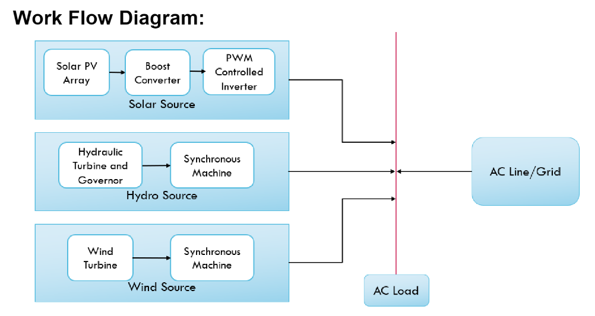
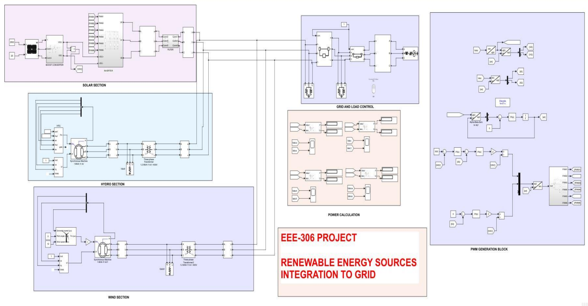
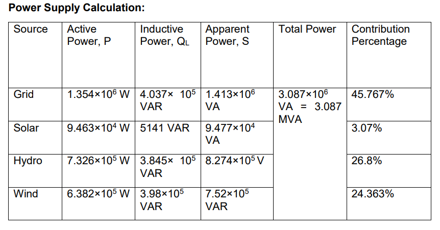

# Grid tied Renewable energy system - Solar Wind and Hydro integration
Development of grid tied Renewable Energy Source (RES), based on Simulink  programming application along with the power flow and consumption study of Grid-RES integrated system.

  

  
  
